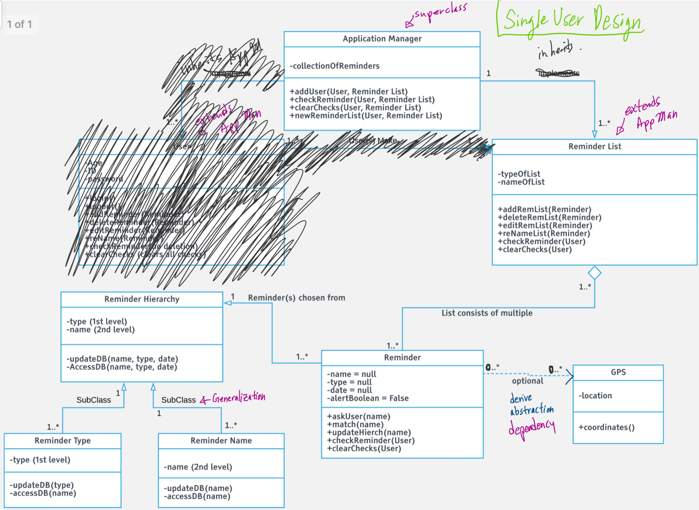
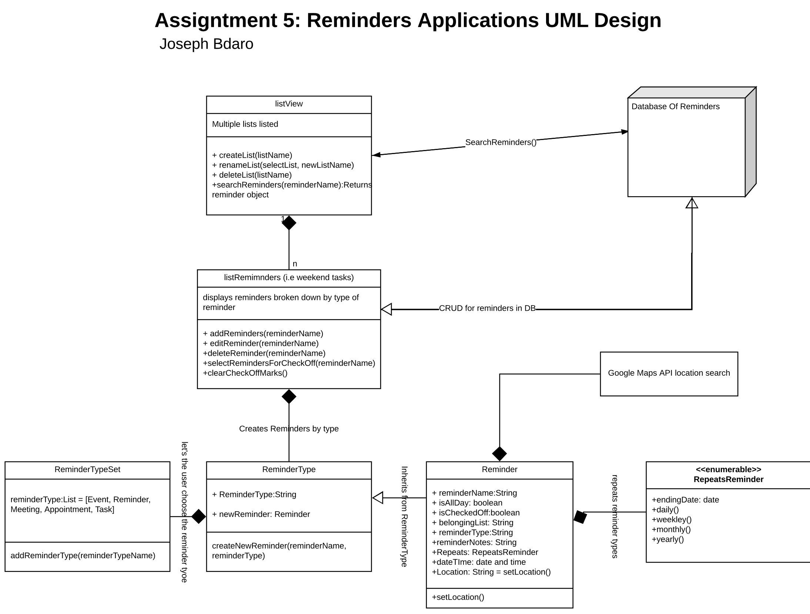
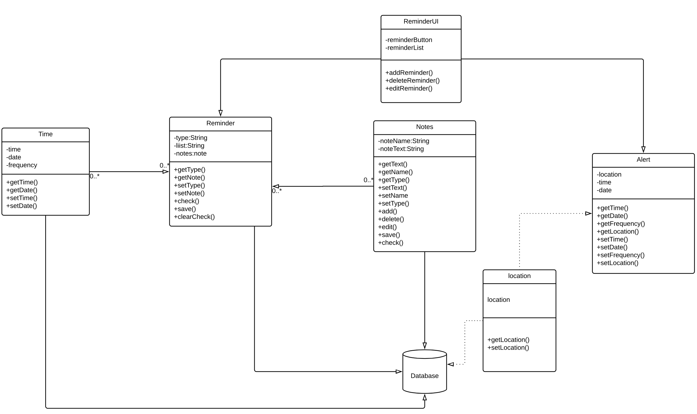
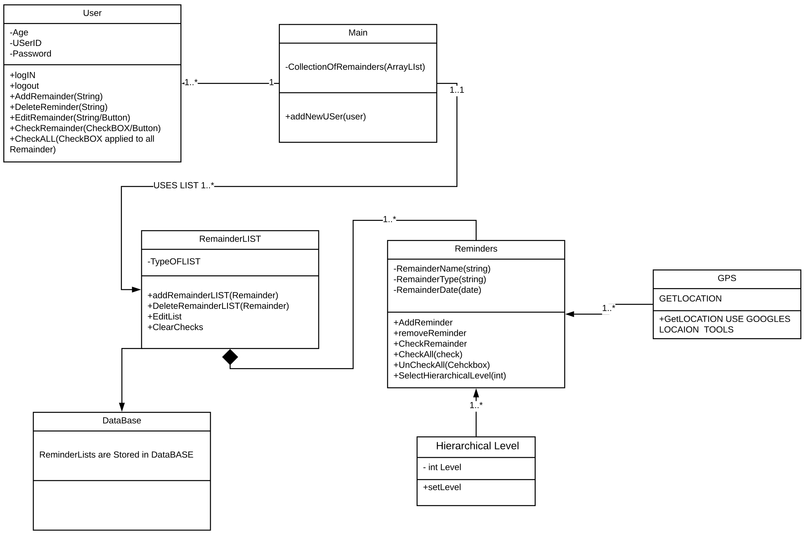
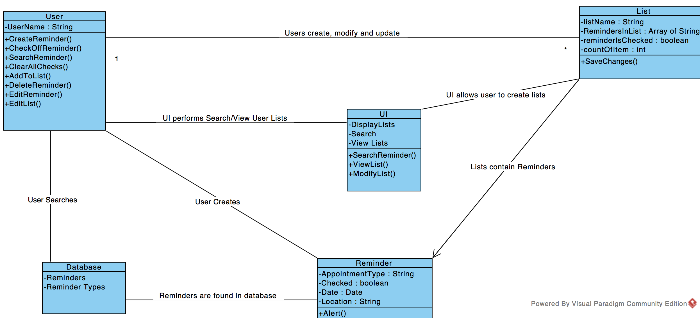
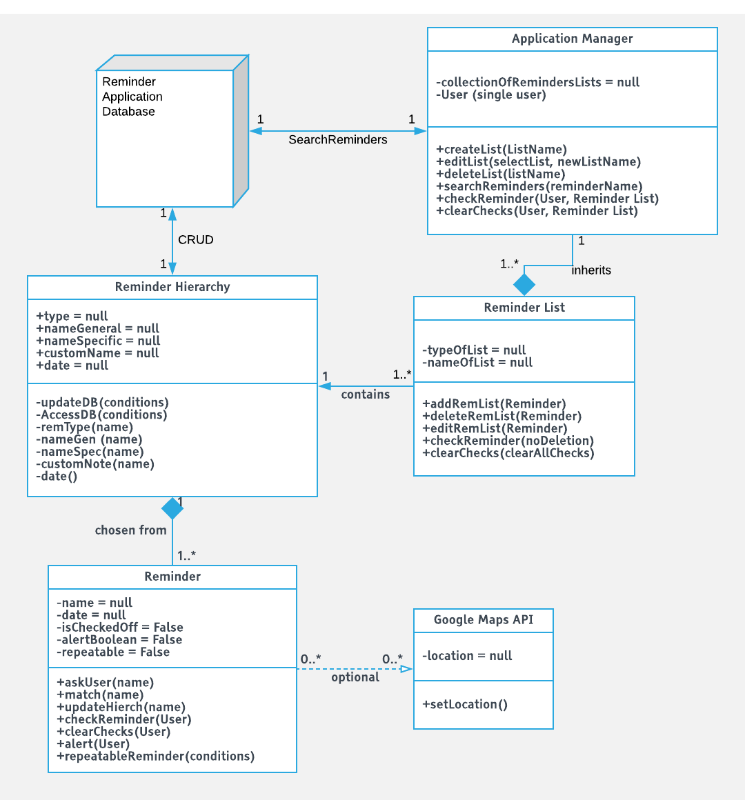

Design 1: ehson assani

<!-- embedded figure -->

Pros: 
1)Good use of encapsulation regarding database. 
2)Design layout from UML to code is well thought.out 
3)App Manager creates a collection of reminders that holds lists of reminders.

Cons: 
1)Heirarchichel level as in priority based alerts, should be non-priority.

****

Design 2: Joseph Bdaro

Pros: 
1)Repeats reminders based on specified date intervals. 
2)Good use of encapsulation regarding database.
CRUD (Create, Read, Update, Delete) 
3)ListView class creates instances of other listReminders classes in which each listReminder holds reminders (arraylist of an arraylist).

cons: 
1)Heavily dependant if one class were to fail, it would compromise the whole application.

****
Design 3: Shangshang Zhu

Pros: 
1)Reminder notes detailing the reminder optinal location class. 

Cons: 
1)There are too many connections made to the database, one one or two classes should have access to db.

****

Design 4: Mohammad Chowderhury

Pros: 
1)listView class creates instances of other listReminders classes in which each listReminder holds reminders (arraylist of an arraylist). 
2)Database is well encapsulated as there's only one connection to it.

Cons: 
1)Does not have alert atribute in the reminder object. 
2)Heirarchichel level as in priority based alerts.

****

Design 5: Adnan Salimi

Pros: 
1)Minimalistic design

Cons: 
1)Does not specify starting class in diagram.  
2)Dependencies are not specified in the line.  
3)Discusses UI elements in UML diagram (should not be discussing UI).

************

Team Design:

Reasoning behind the design: 
Minimalist design (quick and easy transition from UML diagram to final code implementation) while meeting the customer requirements.

Commonalities between individuals design: 
1) All designs included some sort of a view of all created lists. 
2) All designs generally satisfied the requirements to some degree.

Differences between individuals design: 
1) Implementation of notes.  
2) Some designs included support for multiple users while others didn't.  
3) Some implemented features are designed as a class while others were designed as methods.  
4) interactions between each class differed in terms of design (i.e certain classes inherrited from one another while other were composition of one another).

Difference between team design and individual design: 
1) Number of classes were reduced to provide easibility of UML design and implementation of said design.
2) In some designs the heirarchy was implemented with multiple classes where the final design.
simplified the functionality to only one class.  This issue was later cleared by professor Abreu. 
3) Some heirarchy designs included reminder priorities, this idea was scrapped as it was not specified by the requirements.

************

Summary: 

There were different conceptions of how the classes and ultimately the application were to operate. Certain class relationships were inefficient while others caused convoluted dependencies of interlocking classes which then lead to other problems with modularity. This required regular group meetings to ensure an open line of communication and an understanding of a unified UML design. 
We all decided to meet and demo our individual designs in our group meetings.  We outlined the pros and cons of each design.  Ideas were met with open considerations and then evaluated as if implemented in the final product.  This then lead us to re-design as in the slides discussed in class (spiral process and evolutionary prototyping).
The best aspects of each design and re-designs in our view (no pun intented) were incorporated in the final UML class diagram design.

************
