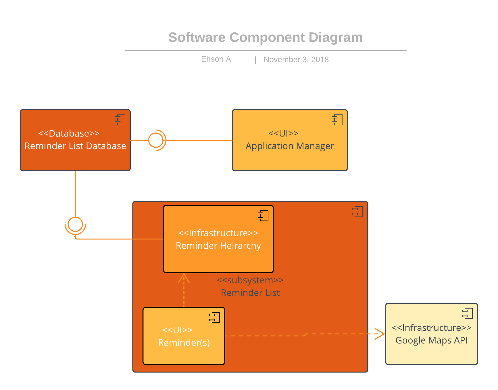
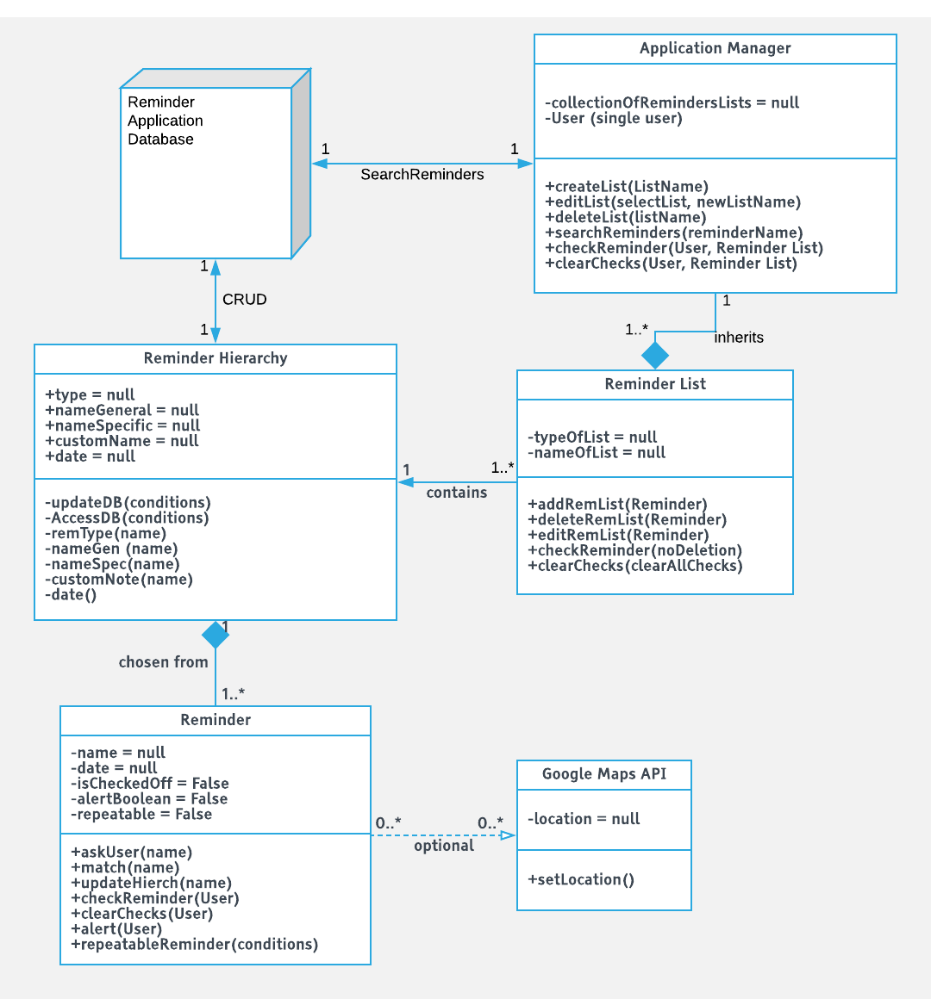
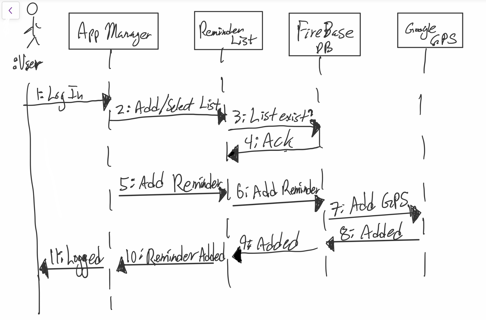
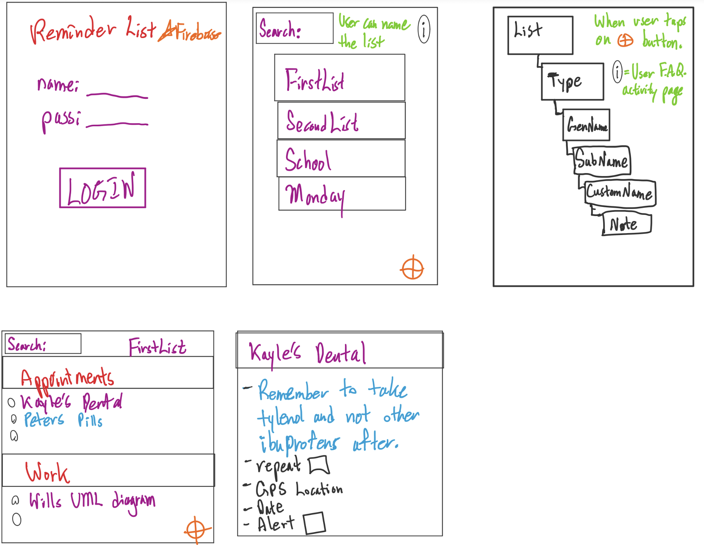

# Design Document

**Author**: ehson assani

## 1 Design Considerations

### 1.1 Assumptions

Significant software issues arised when implementing firebase as our realtime database.  Deleting an element in the array also deletes the remaining elements in the array (this is a design issue with firebase itself).  Were trying to manage the afromentioned issue.  Had to change from using Android studio to IntelliJ as getting error message failing to connect to firebase servers (failed to resolve firebase.0.xx.0).  Design constraints using the Layout view is itself a challenge to find what works when displaying multiple buttons.

### 1.2 Constraints

Our requirements specified certain features ("heirarchy" for reminders) and how it should be structured.  In using Firebase, a noSQL non-heirarchal structured database, we have to manage this all with basic key and value pairs.

### 1.3 System Environment

Android capable smartphones are well suited to handle an app such as this (reminder list). We are targeting devices that support API level 15 and above.

## 2 Architectural Design

The architectual design consists of the component design and the deployment diagram. each diagram is designed and explained below as the following.

### 2.1 Component Diagram

<!-- embedded figure comp diagram -->

As a start, there will be a total of four classes, from our previous, yet minor experience with android development.  The Application Manager will require the database interface (database = lolipop/provide and socket/require = App Manager) and so too will the Reminder List.  Having experimented with firebase, there is a high chance we will need only one class to represent the Reminder List, Reminder Hierarchy, and Reminder(s), therefore we ended up with a subsystem class.  Finally, Reminder will use Google Maps API.  

### 2.2 Deployment Diagram

<!-- embedded figure deploy diagram -->

In regards to server and client components, our database (firebase) will be server-side, so will the use of Google maps API.  Client-side as shown, will contain the App Manager, List, Heirarchy, and Reminder (on the device). 

## 3 Low-Level Design

THe following subsections portray an in depth and most up to date UML class diagram of the reminder list application.

### 3.1 Class Diagram

<!-- embedded figure uml diagram -->

### 3.2 Other Diagrams

<!-- embedded figure -->

In a sequence behavioral diagrams, the user create(s) a list object which then goes through C.R.U.D. standard database and sends back an acknowledgement.  Then the user can create reminder(s) which passes through the db and optional gps tracking, which then the reminder has been added to the list.  Note that this is a very simplified diagram showing the basics of what is actually occurring.

## 4 User Interface Design

