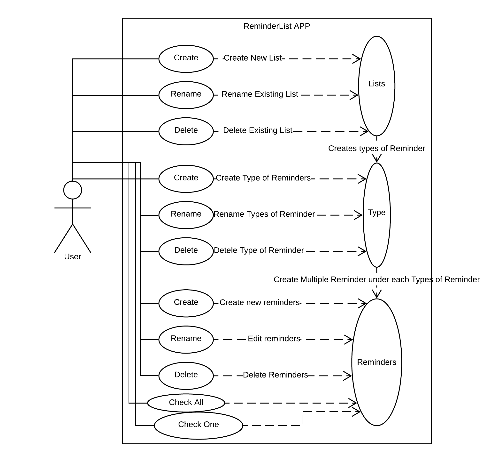

# Use Case Model

*This is the template for your use case model. The parts in italics are concise explanations of what should go in the corresponding sections and should not appear in the final document.*

 Mohammed Chowdhury

## 1 Use Case Diagram

## 2 Use Case Descriptions

*For each use case in the use case diagram, this section should contain a description, with the following elements:*

Requirments: 
User must be able to create reminders that reminds them of what they need to do. Users are able to create differnt lists of reminders. In each list user can create types of reminders i.e appointments, meetings, and chores. In each types of reminders users can create multiple of reminders i.e under reminder type chores, user can creat reminders such as -clean kitchen, -pick up groceries . 

Pre-conditions:

- *User must creat a reminder list, before they can add their reminders.*
- *User must create a reminder type, inside the reminder list before they can add or create or delete their reminders.*

Post-conditions: 
- *User is able to add their reminders under types of reminder*
- *User is able to create different reminder types*
- *User is able to create multiple reminder list.* 
 

Scenarios: 

- *Normal:*
User can create a reminder to remind hir or her, first they will create a list. Assuming the user creates a list for school, they will create a list called school. In the school list they can create types of reminder, such as reminders for meetings, homework, or errands. User can create any types of reminders they wish. Under reminder type meetings user can create reminders like -meet Joe for group project, or -meet professor. 

- *Alternate:* User can create a list and name it "monday", (this will have all the reminders that the user wants to be reminder about in monday). User will create one reminder type and lets assume the user names it "things to do", under this reminder type, the user can create all of their reminders, and this will still work but not as efficently. 

- *Exception:* User uses the list naming as their reminder, or use the reminder type naming as their reminder, this will lead to many confusion with their reminders. 
<!-- - *Requirements: High-level description of what the use case must allow the user to do.*
- *Pre-conditions: Conditions that must be true before the use case is run.* 

Result negative: An Exception is anything that leads to NOT achieving the use case’s goal.
Result positive: An Alternate Flow is a step or a sequence of steps that achieves the use case’s goal following different steps than described in the main success scenario. But the goal is achieved finally.

- *Scenarios: Sequence of events that characterize the use case. This part may include multiple scenarios, for normal, alternate, and exceptional event sequences. These scenarios may be expressed as a list of steps in natural language or as sequence diagrams.*

-->

<!-- - *Post-conditions Conditions that must be true once the use case is run.* -->

