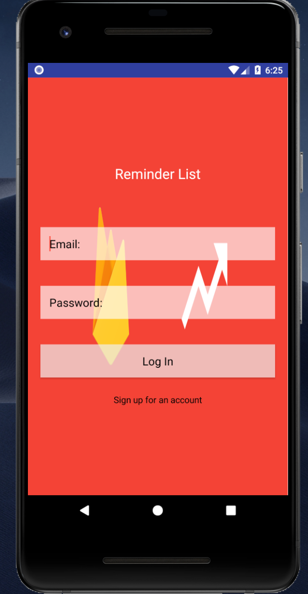
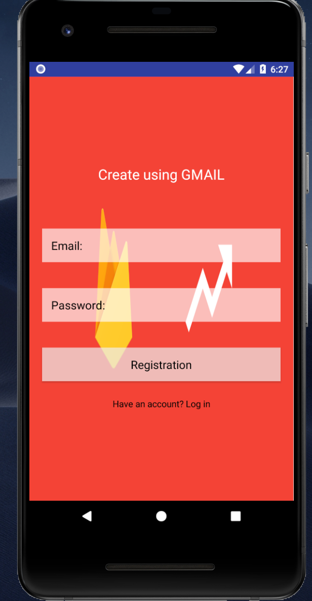
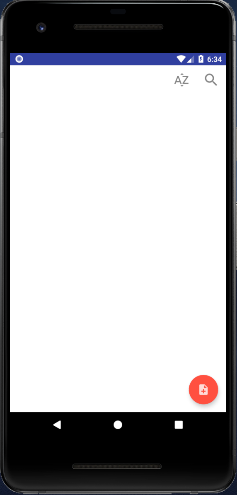
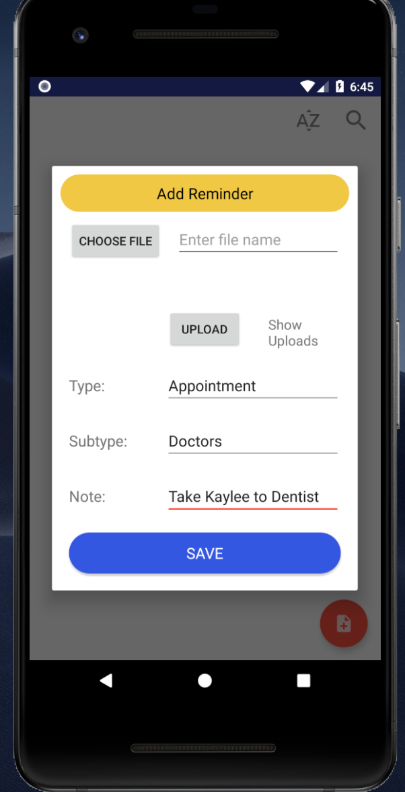
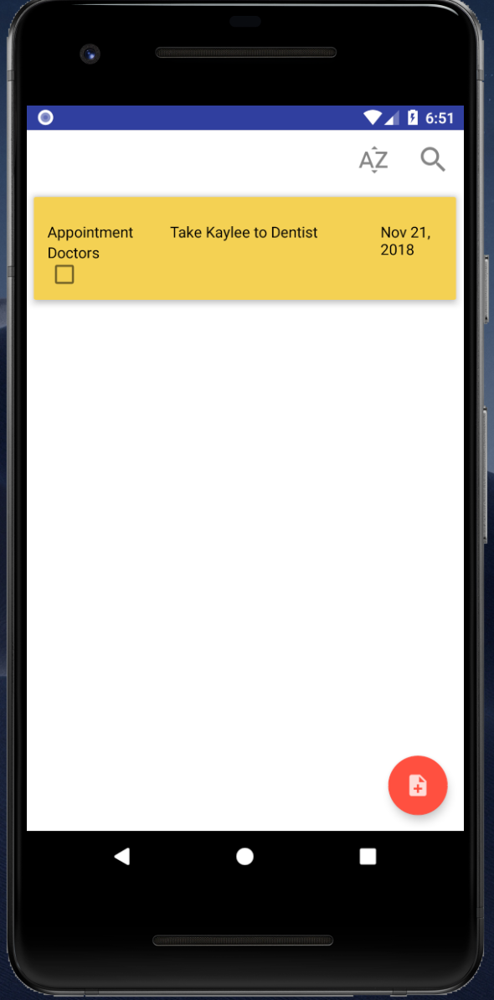
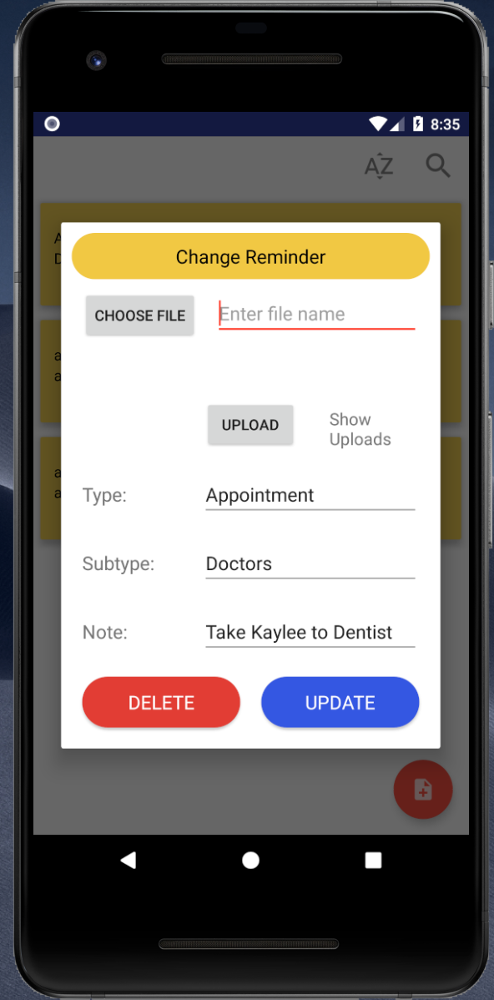

<h1>User Manuel</h1>

User can make reminders that alerts then when they want to be reminded. 
Users can log in from any phone they wish. Because our database is using Google’s database. Users are able to make an account on their tablet and continue working on the app on their phone.  
<!-- {:height="50%" width="50%"} -->
 
 
 When you first open the app, you are greeted with a log in screen. If you don’t already have an account you will have to create an account to use the app. You will need to create an account using your Gmail in order to use the app. 

 

Once you sign in, you are greeted with a blank reminder list. In this page you can make many reminders, and this page will hold all the list of reminders you create.  
 

To add reminders on to the app, you click on the red (Add) icon, and this will allow you to add reminders to the app.  

 

Users can categorize their reminders by the Type, and Subtype. This will allow the user to easily identify and find their reminders easily. 
For example:  User can name a reminder, and the Type of the reminder is Appointment, and Subtype is Doctors, user can add data to the Note such as "Take Kaylee to Dentist" and Save. 
Once the user Presses Save their data is saved to the database safely.  

 
Once user presses save, they are greeted with a toast message saying, "Reminder Added".  
User can add many reminders as they wish. This will allow the user to create a list of reminders. From the list of reminders user can edit, update, or delete the reminders. 

<h1>Edit or Update Reminders</h1>
If the user wants to edit the reminder, they can click on the reminder and make changes to the data and click on update which will save the updated data to the database online, and it will also show the updated data on the app  

<h1>Deleting Reminders</h1>
If the user wants to Delete the reminder, they can click on the reminders and click Delete and the reminder will be removed from the database, thus removing it from the app.  

<h1>Search for a Reminder</h1>
User can search for a specific reminder from the list. Let’s assume the app has 200 reminders, when the user search for a specific reminder they can search for it, and it will show you the reminder you want. 

